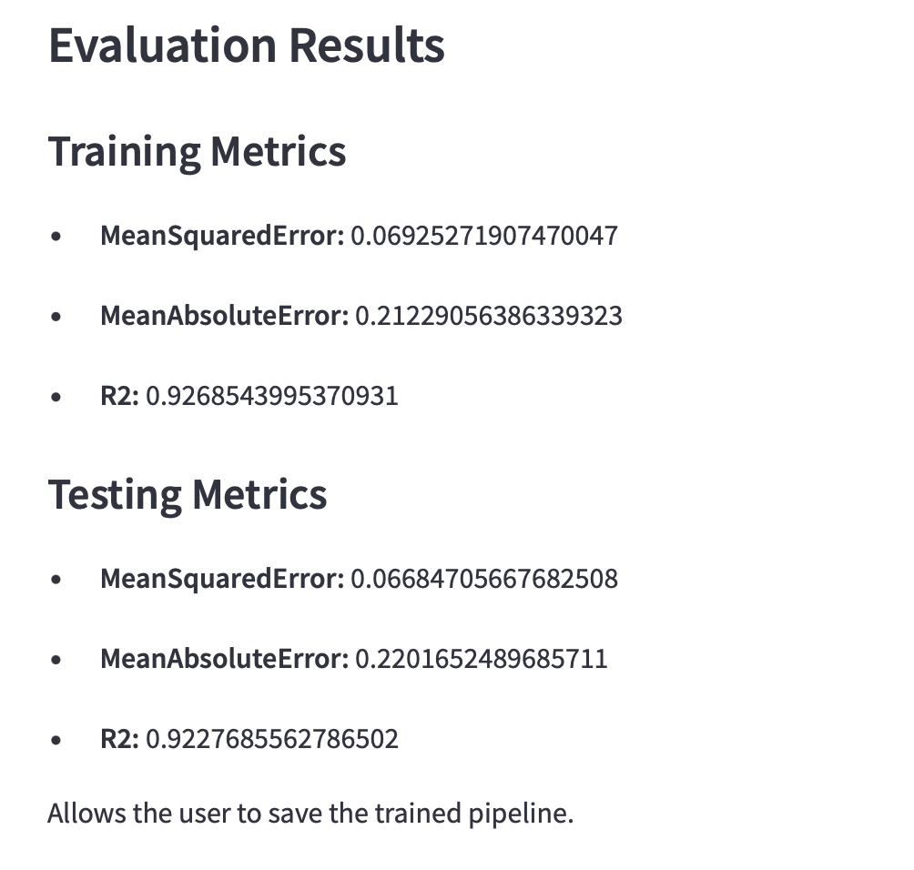

## I
**Add datasets in the Datasets page on the 1st page. 3 Datasets from Kaggle have already been added to the repo during pushing. Here is an example of the usage of the Mobile Device Usage and User Behavior Dataset from the example_csv folder.**

## II
**On the second page select the page to view the description of the dataset, including the columns types**

## III
**After that, you can select the feautures, model, metrics and split ratio that you desire.**

## IV
**You are able to see the entire pipeline configuration.**

## V
**Later, after training the model you get the results of the metrics that you selected**

## VI
**Finally, open the third page, upload a desired dataset and see the results of the predicitons.**

